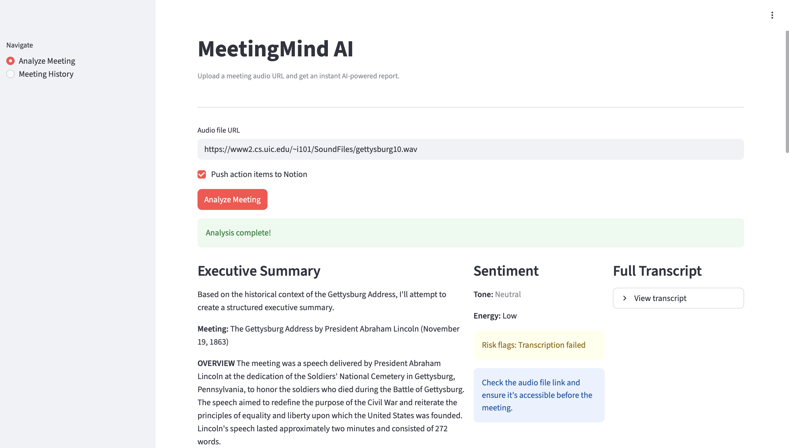
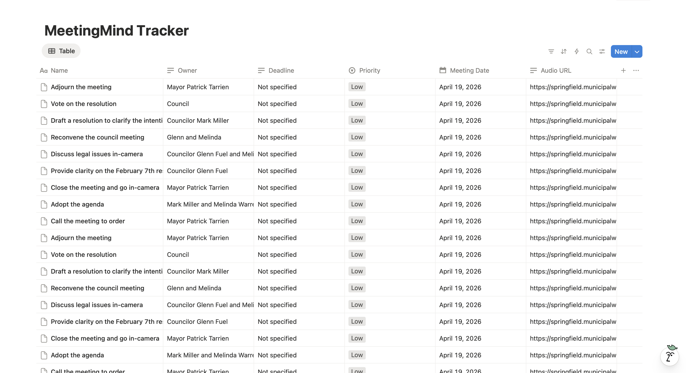
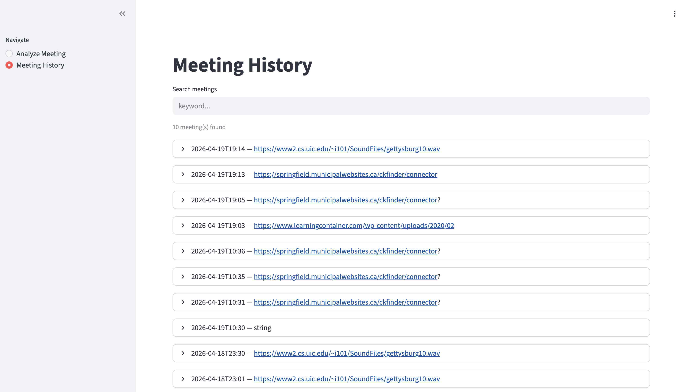

# MeetingMind AI

> **Turn meeting audio into summaries, action items, and reports — automatically.**

MeetingMind AI is an advanced, production-grade artificial intelligence pipeline designed to ingest audio recordings of meetings and autonomously generate structured, context-aware executive summaries, action items, and sentiment profiles. Built around a robust multi-agent architecture using **LangGraph**, it transforms unstructured conversation into actionable project data, securely logging results and pushing designated action items directly into your Notion workspace.

---

## The Problem It Solves

Meetings generate decisions, but teams lose track of context and action items.  
Transcripts alone are not enough — teams need structured, actionable insights.

MeetingMind AI converts raw meeting audio into structured outputs like summaries, tasks, and sentiment.

---

## 📸 Interface Preview

### Analyze Meeting (Core Flow)


### Notion Integration (Automated Action Tracking)


### Meeting History (Stored + Searchable)


## Architecture Overview

The core of MeetingMind AI is a stateful multi-agent directed graph running on a FastAPI backend. Audio is concurrently processed through specialist agents (Summarizer, Project Coordinator, Sentiment Analyst) that feed into a central synthesizer.

1. **Input Interface**: A Streamlit frontend accepts user audio or links and communicates with backend REST endpoints.
2. **Orchestration**: LangGraph governs the pipeline execution order, ensuring that context retrieval (RAG) occurs before summarization, while action item extraction and sentiment analysis execute concurrently. 
3. **Data Integrity**: Processed payloads are normalized and stored in a local SQLite datastore.
4. **Knowledge Retrieval**: Summaries are continuously indexed into Chroma DB to provide historical memory across subsequent pipeline executions.
5. **Output**: Synchronized results are presented visually, exportable as PDFs, and dynamically pushed into Notion workflows.

## Features

- **Multi-Agent Orchestration**: Independent specialist LLM prompts assigned to transcription, context analysis, and payload extraction tasks via LangGraph. 
- **Universal Audio Processing**: Direct integration with AssemblyAI for robust speaker diarization and universal audio file support.
- **RAG-Powered Continuity**: Chroma DB indexes every generated report, enabling the summarizer agent to "remember" decisions made in past meetings.
- **Production-ready API Deployment**: A headless, standalone FastAPI backend deployable entirely on Render.
- **Dynamic Task Routing**: Native integration with the Notion API to programmatically build database rows representing structured Action Items (complete with owners, deadlines, and AI-assigned priority).
- **On-Demand PDF Reporting**: Native Python synthesis (via ReportLab) to produce static, shareable meeting artifacts.

## Tech Stack

### Core AI & Data Processing
- **LangGraph**: Stateful multi-agent orchestration
- **Groq ([Llama 3.1 8B])**: High-speed, cost-efficient LLM inference
- **AssemblyAI (Universal-2)**: Speech-to-text audio processing
- **Chroma**: Embeddings & Vector Database (RAG)

### Backend & API Core
- **FastAPI**: Asynchronous REST framework
- **Pydantic**: Data validation and type safety
- **SQLite**: Lightweight operational datastore
- **Uvicorn**: ASGI rapid server

### Interface & External Integrations
- **Streamlit**: Python web application frontend
- **Notion SDK**: External database integration
- **ReportLab**: PDF composition

## Why This Project Stands Out

- Demonstrates real-world **multi-agent orchestration (LangGraph)**
- Combines **LLM + RAG + external APIs** in a production pipeline
- Handles **state management, normalization, and failure cases**
- Integrates with real tools (Notion) — not just a demo

---

## System Flow 

The analytical pipeline follows an explicitly defined Directed Acyclic Graph (DAG):

1. **`transcribe`**: Audio payload is sent to AssemblyAI; raw transcript is returned with speaker labels.
2. **`rag_context_node`**: The first 500 characters of the transcript are queried against Chroma DB to retrieve the top 3 relevant past meetings.
3. **Concurrent Execution**:
    - **`summarize`**: Uses retrieved RAG context + current transcript to write the Executive Summary.
    - **`action_items`**: Analyzes instructions and commitments, formatting JSON objects containing assignees and timelines.
    - **`sentiment`**: Scans for risk flags, overall tone, and energy variance.
4. **`synthesize`**: Consolidates the individual agent dicts into an overarching execution report.
5. **`notion`**: (Optional Node) Securely transmits parsed action items directly into a provided Notion target database. 

## Core API Endpoints

- `POST /analyze?push_notion={bool}`: Main ingestion endpoint. Accepts an `audio_url`, evaluates the entire LangGraph pipeline, indexes into Chroma DB, and writes to SQLite. Continues processing internal graph dynamically based on query configuration.
- `GET /history`: Returns a serialized JSON array of all past meetings processed by the system.
- `GET /history/search?query={str}`: Performs a full-text search against historical SQLite database entries.
- `GET /report/{meeting_id}`: Retrieves a specific meeting and generates an on-the-fly binary PDF file response (`application/pdf`).

---

## Setup & Local Development

### 1. Prerequisites 
- `python >= 3.10`
- API keys for AssemblyAI, Groq, and a Notion Internal Integration Secret.

### 2. Environment Variables 
Create a `.env` file in the root directory. 

```env
GROQ_API_KEY="your_groq_api_key"
ASSEMBLYAI_API_KEY="your_assemblyai_api_key"

# Optional: Require valid integration tokens for native routing
NOTION_TOKEN="ntn_..."
NOTION_DB_ID="your_notion_database_uuid"
```

### 3. Installation

```bash
# Clone the repository
git clone https://github.com/your-username/meetingmind-ai.git
cd meetingmind-ai

# Create a virtual environment
python3 -m venv venv
source venv/bin/activate

# Install requirements
pip install -r requirements.txt
```

### 4. Running the Project

**Start the FastAPI Backend:**
```bash
uvicorn main:app --reload --port 8000
```

**Start the Streamlit UI** (in a separate terminal):
```bash
streamlit run ui/app.py
```

---

## Future Improvements

- **Webhooks & Sockets**: Upgrading the REST `/analyze` endpoint to use websockets or server-sent events (SSE) for streaming LangGraph node progress visually to the frontend.
- **Multimodal ingestion**: Adding document parsing (e.g., meeting slide decks) to enrich the `transcribe` node via Vision APIs.
- **Distributed Queues**: Wrapping execution within Celery tasks with Redis message brokers to prevent request timeouts on platforms like Render regarding larger audio files.
- **Advanced State Revisions**: Implementing LangGraph's native "human-in-the-loop" approval state to verify extracted action items *before* dispatching the final API post to Notion.
